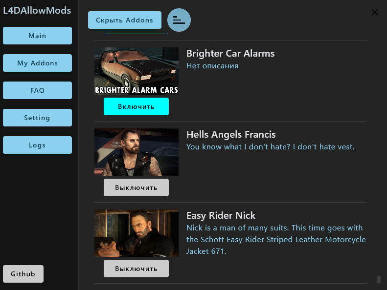

# **L4DAllowMods**

## **Описание**

Позволяет включать Addons из workshop в Left 4 Dead 2, в любом режиме игры, сражение, кооператив и прочее.

## **Планы**
- Поправить фильтр сортировки
- Добавить ссылку на id workshop

## **Стек технологий**

Проект разработан с использованием следующих технологий:

- **Kotlin Multiplatform**: Основной язык разработки, поддерживающий написание общего кода для нескольких платформ.
- **Jetpack Compose Desktop**: Для создания пользовательского интерфейса на Windows.
- **Coroutines**: Для управления асинхронными операциями.
- **Gradle**: Система сборки проекта.
