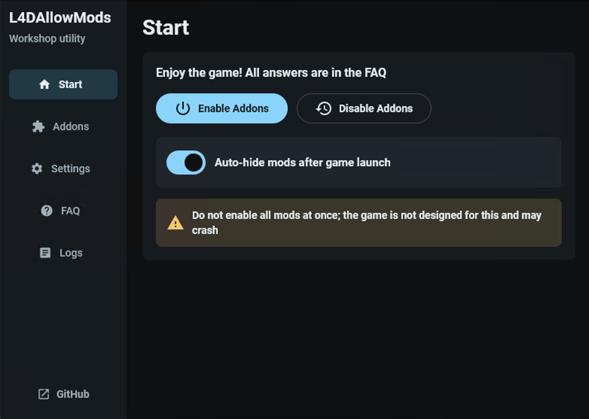
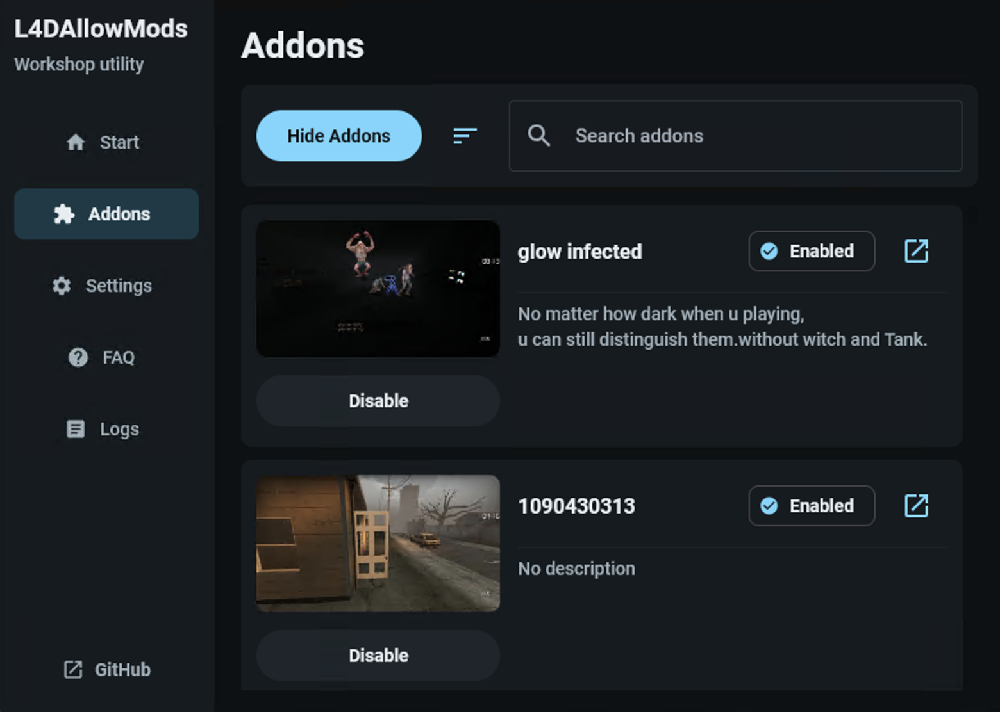
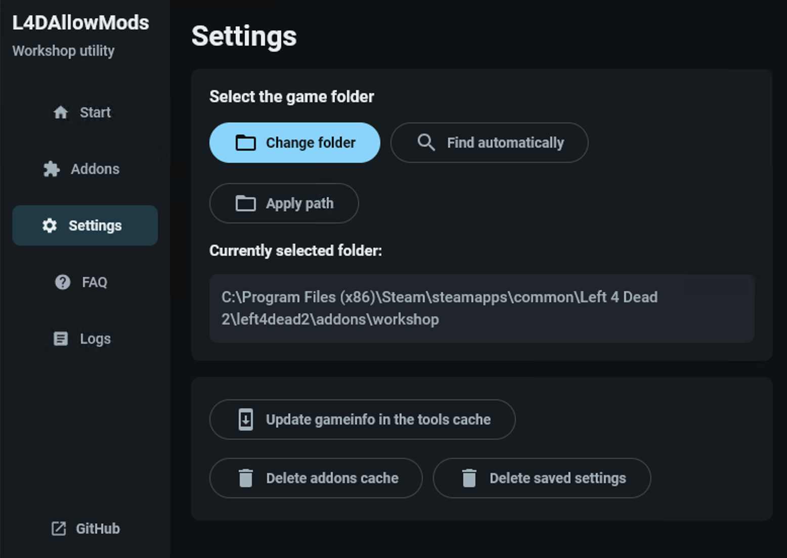
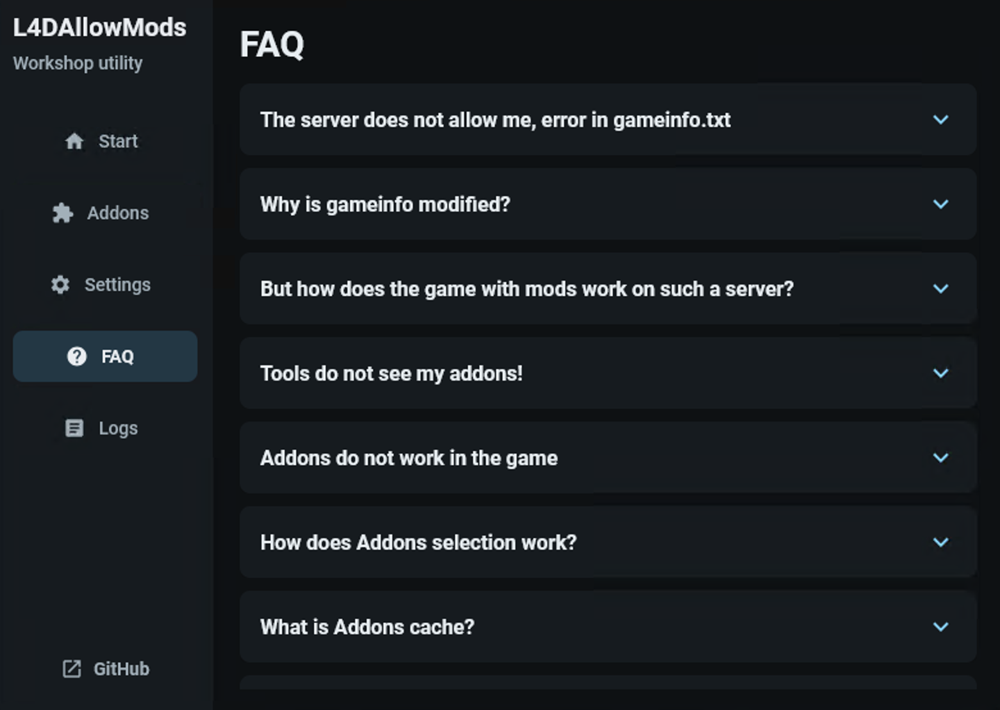

# L4D Allow Mods

**L4D Allow Mods** is a desktop utility for **Left 4 Dead 2** players who want to bypass addon restrictions. It helps enable Workshop addons and cheat-style plugins in **Versus** and on servers where addons are normally blocked, using a clean Windows desktop interface.

[Download latest release](https://github.com/EtoZheSandy/L4DAllowMods/releases) | [GitHub Pages](https://etozhesandy.github.io/L4DAllowMods/) | [Report an issue](https://github.com/EtoZheSandy/L4DAllowMods/issues)

If this project saved you time, helped with your setup, or made restricted-server modding less annoying, please give the repository a star. It helps other L4D2 players find the tool.

## Screenshots

| Addons | Settings |
| --- | --- |
|  |  |

## Highlights

- Enable and disable Workshop addons for Versus and restricted servers.
- Use cheat-style plugins and custom addons in places where the game normally blocks them.
- Scan the `left4dead2/addons/workshop` folder and show addon details.
- Search, sort, and manage addon visibility in a dedicated Addons screen.
- Restore or refresh cached `gameinfo.txt` data when needed.
- Keep selected addons and settings between launches.
- Auto-hide prepared mods after game launch.
- Localized UI with English, Russian, Chinese, Spanish, Arabic, Japanese, French, and German resources.
- Not a game modification: no launcher, DLL injection, executable patching, or runtime memory editing.
- VAC is not expected to trigger from this mechanism because the tool only forces Steam Workshop addons to load through `gameinfo.txt`.

## How It Works

L4D Allow Mods prepares selected Workshop `.vpk` files and updates the Left 4 Dead 2 `gameinfo.txt` paths so the game can load addons even in modes and server contexts that normally reject them. The app keeps a cached copy of the original `gameinfo.txt`, which allows you to disable addons and restore the previous state from the UI.

The workflow is file-based: the tool does not hook the game process, inject code, patch game memory, or modify the game executable while Left 4 Dead 2 is running. It simply forces selected Steam Workshop addons to be included in the game's addon loading paths.

## Quick Start

1. Download the latest Windows build from [Releases](https://github.com/EtoZheSandy/L4DAllowMods/releases).
2. Open the app and choose your Left 4 Dead 2 installation folder.
3. Let the tool find `left4dead2/addons/workshop`, or apply the path manually.
4. Open the Addons screen and select the Workshop addons or cheat-style plugins you want to use.
5. Click **Enable Addons** before launching the game or joining a restricted server.
6. Click **Disable Addons** when you want to restore the normal setup.

Avoid enabling every addon at once. Left 4 Dead 2 was not designed for that kind of load, and the game may crash.

## Tech Stack

- Kotlin Multiplatform
- Jetpack Compose Desktop
- Kotlin Coroutines
- Kotlinx Serialization
- Gradle
- Windows MSI/EXE packaging

## Disclaimer

This project is a cheat-oriented addon restriction bypass tool. It is not a game binary modification and does not use injection or runtime memory patching, so VAC is not expected to trigger from the tool's mechanism itself. Using it on public or competitive servers may still violate server rules, community rules, or fair-play expectations. Use it at your own risk and keep backups of important game files when experimenting with mods.

## Star The Project

L4D Allow Mods is built for players who want addon freedom in restricted modes and servers. If it helped you, please star the repository on GitHub:

[Star EtoZheSandy/L4DAllowMods](https://github.com/EtoZheSandy/L4DAllowMods)
