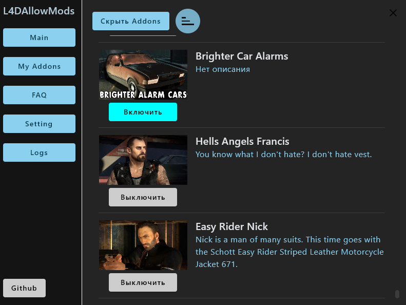

# 🧩 L4D Allow Mods — Enable Any Mods on Any Server (Left 4 Dead 2)

## 🚀 What is L4D Allow Mods?

**L4D Allow Mods** is a powerful utility for **Left 4 Dead 2** that allows you to **enable any mods from the Steam Workshop**, including **cheat mods and custom addons**, on **any server and in any game mode**.

The tool removes server-side limitations that normally block addons and gives players **full control over their game content**.

Works in **Versus, Coop, Survival**, and other modes.

---

## 🔥 Key Features

- ✅ Enable **any mods on any server**
- 🧩 Supports **Workshop mods and cheat addons**
- ⚔️ Works in **Versus / Coop / Survival**
- 🧠 Remembers selected mods and settings
- ⚡ Instant apply, no complex setup
- 🌍 UI available in **8 languages**
- 🛠️ No DLL injection, no memory hacks, no launchers

---

## 🧠 How It Works

**L4D Allow Mods** modifies the `gameinfo.txt` file, allowing **Left 4 Dead 2** to load **any addons**, bypassing standard server restrictions.

No runtime hooks, no patching, no game file corruption.

Just clean and effective behavior control.

---

## 🎯 Who Is This For?

- Players who want to **use mods in Versus**
- Fans of **custom gameplay and experiments**
- Mod testers and map creators
- Content creators and video makers
- Anyone tired of server restrictions 😈

---

## 🌐 Supported Languages

- English  
- Russian  
- Chinese  
- Spanish  
- Arabic  
- Japanese  
- French  
- German  

---

## 🛠️ Tech Stack

- Kotlin Multiplatform
- Jetpack Compose Desktop (Windows)
- Kotlin Coroutines
- Gradle
- Kotlinx Serialization (JSON)

---

## ⚠️ Disclaimer

This project is provided for **educational and research purposes only**.  
Use it responsibly and respect server rules.

---

⭐ If you find this project useful, consider starring the repository!
